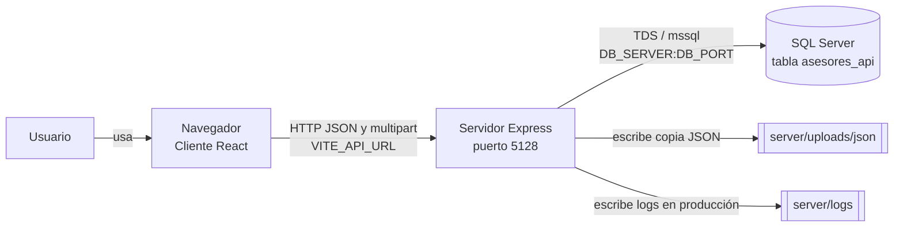
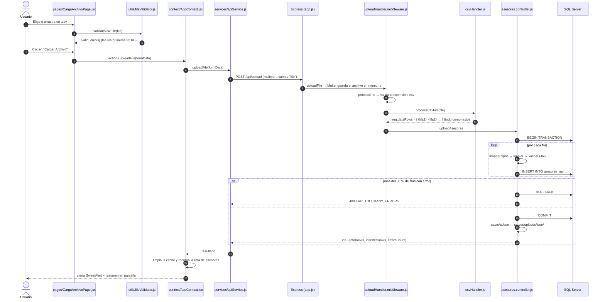
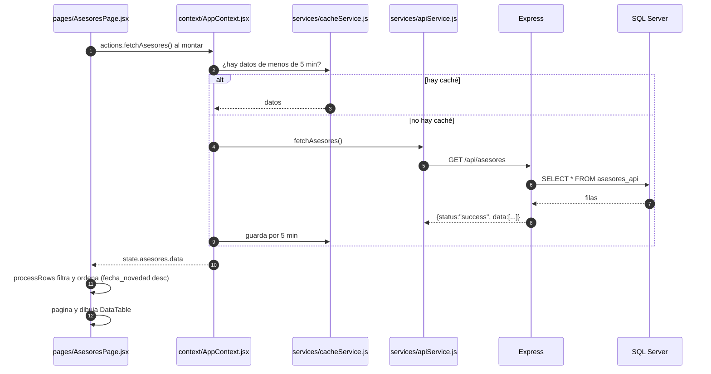

# 1. Visión general y arquitectura

> **Empieza aquí.** Este documento explica *qué hace* el sistema, *de qué piezas está hecho* y *cómo se comunican*. No necesitas saber nada del proyecto para leerlo.

## 1.1 ¿Qué problema resuelve?

DataDock es un **muelle de datos**: una plataforma web para **cargar datos tabulares desde archivos CSV a SQL Server**, validarlos contra un esquema, guardarlos en una transacción y **consultarlos después en una tabla con filtros**.

La plataforma separa lo genérico (recepción de archivos, lectura del CSV, transacciones, errores, consulta y exportación) de lo específico de cada tipo de dato, que se define como un **dominio**: su modelo y validación, su tabla, sus rutas y sus vistas. Hoy incluye un dominio, **asesores**, que sirve como implementación de referencia; toda la documentación lo usa como ejemplo. Para agregar otro, ver [10, sección 10.4](10-guias-de-cambio-y-escalado.md#104-agregar-una-entidad-de-negocio-nueva-un-dominio).

Un usuario típico del dominio asesores hace esto:

1. Abre la aplicación en el navegador.
2. Va a **Cargar Archivo** y elige un archivo `.csv` con asesores (una fila por asesor).
3. La aplicación revisa el archivo y lo envía al servidor, que guarda cada fila en la tabla `asesores_api` de SQL Server.
4. Va a **Asesores** y ve la lista de asesores guardados: puede buscar, filtrar por fechas, guardar filtros y exportar a CSV o JSON.

## 1.2 Las tres piezas del sistema

El sistema tiene **tres piezas que se ejecutan por separado**. Entender esta separación es lo más importante de todo el onboarding.

| Pieza | Carpeta | Tecnología | Dónde corre | Puerto por defecto |
| --- | --- | --- | --- | --- |
| **Cliente** (frontend) | `client/` | React 18 + Vite 4 + Tailwind CSS 3 | En el **navegador** del usuario | `5173` (desarrollo) / `80` (Docker) |
| **Servidor** (backend / API) | `server/` | Node.js 22 + Express 4 | En una **máquina servidor** (o en tu PC durante el desarrollo) | `5128` |
| **Base de datos** | *(externa; el script de la tabla está en `server/database/migrations/`)* | Microsoft SQL Server / Azure SQL | En un servidor de base de datos | `1433` |

Qué significa en la práctica:

- **El cliente nunca habla con la base de datos.** Solo habla con el servidor, por HTTP.
- **Solo el servidor conoce las credenciales** de la base de datos.
- Si el servidor está apagado, el cliente se abre igual, pero muestra "No se puede conectar al servidor".
- Si la base de datos está caída, el servidor arranca igual, pero las peticiones que tocan datos devuelven error 500.

## 1.3 Diagrama de arquitectura

> Los diagramas usan [Mermaid](https://mermaid.js.org/). GitHub y GitLab los dibujan automáticamente. En VS Code instala la extensión *Markdown Preview Mermaid Support* para verlos en la vista previa.



Versión en texto del mismo diagrama:

```text
Usuario ──> Navegador (client/, React)
               │  HTTP  → http://localhost:5128/api/...
               ▼
           Servidor (server/, Express)  ──> SQL Server (tabla asesores_api)
               │
               ├──> server/uploads/json/  (copia JSON de cada carga correcta)
               └──> server/logs/          (solo con LOG_TO_FILE=true o NODE_ENV=production)
```

## 1.4 Estructura de carpetas (vista general)

```text
datadock/
├── client/                 ← Aplicación React (lo que ve el usuario)
│   ├── src/
│   │   ├── pages/          ← Una página por ruta (/asesores, /upload)
│   │   ├── components/     ← Piezas de interfaz reutilizables
│   │   ├── context/        ← Estado global (AppContext)
│   │   ├── services/       ← Comunicación con la API, caché y alertas
│   │   └── utils/          ← Funciones puras (validación de CSV, filtrado)
│   ├── __tests__/          ← Pruebas del cliente (Vitest)
│   ├── public/             ← Archivos estáticos (ícono)
│   ├── nginx/              ← Servidor web de la imagen Docker
│   └── Dockerfile
├── server/                 ← API Express (lógica y acceso a datos)
│   ├── src/
│   │   ├── routes/         ← Rutas generales (estado del servidor)
│   │   ├── domains/        ← Negocio, agrupado por entidad (asesores)
│   │   ├── middlewares/    ← Pasos previos reutilizables (recibir archivos, logs)
│   │   ├── database/       ← Conexión y consultas SQL
│   │   └── utils/          ← Errores, logger, CSV, archivos, Swagger
│   ├── database/migrations/← Scripts SQL de la tabla
│   ├── __tests__/          ← Pruebas del servidor (Jest + Supertest)
│   └── Dockerfile
├── docs/                   ← Esta documentación
├── .github/workflows/      ← Integración continua (GitHub Actions)
├── docker-compose.yml      ← Levanta cliente + servidor con Docker
├── .nvmrc                  ← Versión de Node del proyecto (22)
└── package.json            ← Scripts que orquestan cliente y servidor a la vez
```

El detalle archivo por archivo está en [13-inventario-de-archivos.md](13-inventario-de-archivos.md).

## 1.5 Tres `package.json`: por qué y para qué

Este repositorio **no es un monorepo con *workspaces***. Son tres proyectos npm independientes:

| Archivo | Qué instala | Para qué sirve |
| --- | --- | --- |
| `package.json` (raíz) | Solo `concurrently` | Scripts que actúan sobre `client/` y `server/` a la vez (`npm run dev`, `npm test`, `npm run lint`, `npm run build`) |
| `client/package.json` | React, Vite, Tailwind, Vitest… | Todo lo del frontend |
| `server/package.json` | Express, mssql, Multer, Joi, Jest… | Todo lo del backend |

Cada uno tiene su propio `node_modules/` y su propio `package-lock.json`. Por eso hay que instalar **tres veces**; el script `npm run ci-all` lo hace por ti.

## 1.6 Flujo 1: cargar un archivo CSV, paso a paso

Es el flujo principal del sistema. Síguelo con el código abierto al lado.



Qué pasa en cada paso, en palabras:

1. **Validación en el navegador** (`client/src/utils/fileValidator.js`). Antes de enviar nada se revisa la extensión `.csv`, que pese menos de 10 MB, que tenga las columnas obligatorias y que las primeras 5 filas tengan valor en ellas. Es una **ayuda para el usuario**, no una medida de seguridad: el servidor vuelve a validarlo todo.
2. **Envío** (`client/src/services/apiService.js`). Se arma un `FormData` con el campo `file` y se hace `POST` a `VITE_API_URL + /upload`.
3. **Recepción** (`server/src/middlewares/uploadHandler.middleware.js`). Multer lee el archivo **en memoria** (no lo escribe en disco) y lo rechaza con `413` si supera `MAX_FILE_SIZE`.
4. **Lectura del CSV** (`server/src/utils/csvHandler.js`). Convierte el texto en una lista de objetos, uno por fila, **siempre como texto**. Las cabeceras pasan a minúsculas y los espacios a `_`. El separador se detecta (`;`, `,`, tabulador o `|`) salvo que se fije `CSV_DELIMITER`.
5. **Guardado** (`server/src/domains/asesores/controllers/asesores.controller.js`). Abre una transacción y, por cada fila, convierte cada campo al tipo que define el modelo (solo `fecha_novedad` es una fecha; el resto es texto), la valida y la inserta. Si **más del 30 %** de las filas falla, deshace todo (*rollback*). Si no, confirma (*commit*) aunque algunas filas hayan fallado.
6. **Respuesta**. El cliente muestra cuántas filas se insertaron y cuántas fallaron, y recarga la lista.

## 1.7 Flujo 2: ver la lista de asesores



Puntos clave:

- **Todo el filtrado, el orden y la paginación ocurren en el navegador** (`client/src/utils/dataProcessing.js`). El servidor devuelve *todas* las filas de una vez. Es simple, pero no escala a decenas de miles de registros (ver [10-guias-de-cambio-y-escalado.md](10-guias-de-cambio-y-escalado.md)).
- La caché vive **en la memoria del navegador**: se pierde al recargar la página (F5).
- Las fechas se muestran con el **día del calendario que envía la API**, sin desplazarlas por la zona horaria del navegador.

## 1.8 Flujo 3: detección de conectividad

Al arrancar, `AppContext.jsx` espera 1 segundo y hace `GET /health` para saber si el servidor responde. También escucha los eventos `online`/`offline` del navegador. Con eso decide si mostrar los avisos amarillos de "Sin conexión". `/health` **no consulta la base de datos**: mide solo si el proceso del servidor responde.

## 1.9 Capas del servidor

El servidor está organizado en capas. Cada petición las atraviesa **en este orden**:

```text
index.js             → arranca el proceso y escucha el puerto
  app.js             → arma Express: CORS, logs, parsers, Swagger, rutas, 404, errores
    routes/          → rutas generales (estado del servidor)
    domains/<entidad>/routes/      → decide qué función atiende cada URL de negocio
      middlewares/   → trabajo previo reutilizable (recibir el archivo, leer el CSV)
        domains/<entidad>/controllers/ → la lógica del caso de uso
          domains/<entidad>/models/    → forma, tipos, limpieza y validación de los datos
          database/  → conexión y consultas SQL
    utils/errorHandler.js → convierte cualquier error en una respuesta JSON estándar
```

La carpeta `server/src/domains/asesores/` agrupa lo **específico del negocio "asesores"** (rutas, controlador, modelo). Lo genérico (logs, errores, archivos, CSV) vive en `server/src/utils/` y `server/src/middlewares/`. Si mañana se agrega otra entidad, por ejemplo "clientes", se crea `server/src/domains/clientes/` con la misma forma.

## 1.10 Capas del cliente

```text
main.jsx                    → monta React en <div id="root"> de index.html
  App.jsx                   → provee el estado global y define las rutas
    context/AppContext.jsx  → estado global + acciones (cargar asesores, subir archivo)
      services/apiService.js    → única puerta de salida HTTP hacia el servidor
      services/cacheService.js, services/notifications.js
    components/NavBar.jsx
    pages/CargaArchivoPage.jsx  → página /upload
    pages/AsesoresPage.jsx      → página /asesores
      components/asesores/*     → tabla, paginación, filtros, exportación…
      utils/dataProcessing.js   → filtrado, orden y formato de fechas (funciones puras)
```

Regla de oro del cliente: **los componentes no llaman a `fetch` directamente**. Piden cosas a `AppContext` (`actions.fetchAsesores()`, `actions.uploadFile()`), y `AppContext` usa `apiService`. Así, si cambia la API, solo se toca `apiService.js`.

## 1.11 Glosario

| Término | Qué significa aquí |
| --- | --- |
| **Asesor** | Un registro de la tabla `asesores_api`: una persona con su equipo, compañía y fecha de novedad. |
| **Fecha de novedad** (`fecha_novedad`) | Fecha en que ocurrió el cambio que se registra. No puede ser futura. |
| **Carga** | Un envío de archivo CSV al endpoint `POST /api/upload`. |
| **Middleware** | Función de Express que se ejecuta *antes* del controlador; recibe `(req, res, next)`. |
| **Controlador** | Función que atiende una ruta y decide la respuesta. |
| **Esquema de mapeo** | Tabla del modelo que dice, por cada campo, de qué columna del CSV sale, qué tipo tiene y si es obligatorio. |
| **Transacción** | Grupo de operaciones SQL que se aplican todas juntas (*commit*) o ninguna (*rollback*). |
| **Contexto (React)** | Mecanismo para compartir estado entre componentes sin pasar *props* manualmente. |
| **Reducer** | Función pura que recibe `(estado, acción)` y devuelve el nuevo estado. |
| **Vite** | Herramienta que sirve el cliente en desarrollo y lo empaqueta para producción. |
| **Babel** | Traduce el JavaScript moderno del servidor (`import`/`export`) a una forma que Node ejecuta en `dist/`. |
| **CORS** | Regla del navegador que impide que una página llame a otro dominio o puerto salvo que el servidor lo permita. |

Siguiente paso: [02-instalacion-y-entorno.md](02-instalacion-y-entorno.md).
