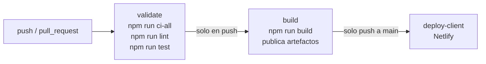

# 9. Docker, integración continua y despliegue

> Cómo se empaqueta y se publica la aplicación. Si solo vas a desarrollar, no necesitas esta página el primer día.

## 9.1 Compilar sin Docker

```bash
npm run build
```

| Genera | Con | Contenido |
| --- | --- | --- |
| `server/dist/` | Babel | El código de `server/src/` traducido a CommonJS. Se ejecuta con `node dist/index.js` (o `npm start` desde la raíz). |
| `client/dist/` | Vite | `index.html` + `assets/*.js` + `assets/*.css` minificados. Son archivos estáticos: cualquier servidor web los puede servir. |

Para ver el build del cliente localmente: `npm --prefix client run preview` (sirve `client/dist` en `http://localhost:4173`).

Para arrancar el servidor compilado en modo producción:

**PowerShell:**

```powershell
$env:NODE_ENV = "production"; npm start
```

**CMD:**

```cmd
set "NODE_ENV=production" && npm start
```

**bash / zsh:**

```bash
NODE_ENV=production npm start
```

## 9.2 Imágenes Docker

### `server/Dockerfile` (dos etapas)

1. **Etapa `build`** (`node:22-alpine`): `npm ci` (todas las dependencias), copia el código y ejecuta `npm run build` → `dist/`.
2. **Etapa final** (`node:22-alpine`): `npm ci --omit=dev` (solo dependencias de producción, incluida `@babel/runtime`), copia `dist/` desde la etapa anterior, crea `uploads/`, cambia al usuario sin privilegios `node` y arranca `node dist/index.js`.
   - Variables fijadas: `NODE_ENV=production`, `HOST=0.0.0.0`, `PORT=5128`.
   - `HEALTHCHECK`: cada 10 s consulta `http://127.0.0.1:5128/status-server`.

### `client/Dockerfile` (dos etapas)

1. **Etapa `build`** (`node:22-alpine`): recibe `ARG VITE_API_URL` (por defecto `http://localhost:5128/api`), `npm ci`, `npm run build`.
2. **Etapa final** (`nginx:alpine`): copia `client/dist` a `/usr/share/nginx/html` y la configuración `client/nginx/nginx.conf`. Escucha en el puerto 80. `HEALTHCHECK` sobre `/`.

### `client/nginx/nginx.conf`

- `try_files $uri $uri/ /index.html`: cualquier ruta (`/asesores`, `/upload`) devuelve `index.html` y React decide qué mostrar. Sin esto, recargar la página en `/upload` daría 404.
- Compresión gzip, caché de 30 días para imágenes/CSS/JS.
- Cabeceras de seguridad, incluida **Content-Security-Policy**. Su directiva `connect-src` enumera a qué URLs puede llamar el navegador:

  ```text
  connect-src 'self' http://localhost:5128 https://api.datadock.example;
  ```

  ⚠️ **Si la API de producción está en otro dominio, agrégalo aquí**; si no, el navegador bloqueará las llamadas (error de CSP en la consola).

### `.dockerignore`

`client/.dockerignore` y `server/.dockerignore` impiden copiar a la imagen `node_modules` (binarios de tu sistema operativo que no funcionan en Linux), `dist`, `logs`, `uploads` y **los archivos `.env` con secretos**.

## 9.3 `docker-compose.yml`

Levanta **cliente + servidor** (no la base de datos):

| Servicio | Puerto en tu máquina | Detalles |
| --- | --- | --- |
| `server` | `5128` | Lee `server/.env` (si existe) para las credenciales `DB_*`. Fija `NODE_ENV=production`, `PORT=5128`, `HOST=0.0.0.0`, `CORS_ORIGIN=http://localhost,https://datadock.netlify.app` y la limpieza de archivos; estos valores de `environment` tienen prioridad sobre `server/.env`. Volumen `uploads` para no perder las copias JSON al recrear el contenedor. Healthcheck en `/status-server`. |
| `client` | `80` | Se construye con `VITE_API_URL=http://localhost:5128/api`. Espera a que `server` esté sano (`depends_on: condition: service_healthy`). |

**Base de datos desde el contenedor:** dentro de un contenedor, `localhost` es el propio contenedor, no tu máquina. Si SQL Server corre **en tu máquina** (instalado o en otro contenedor con el puerto 1433 publicado), pon en `server/.env`:

```ini
DB_SERVER=host.docker.internal
```

El compose ya declara `extra_hosts: host.docker.internal:host-gateway`, así que ese nombre funciona también en Linux. Si `server/.env` no existe, el compose arranca igual (`required: false`), pero las operaciones de datos fallarán con 500.

### Comandos

```bash
docker compose up --build -d      # construye y levanta en segundo plano
docker compose ps                 # estado; espera "healthy" en server
docker compose logs -f server     # logs del servidor en vivo (Ctrl+C para salir)
docker compose down               # detiene y elimina los contenedores (el volumen se conserva)
docker compose down -v            # además borra el volumen uploads
docker compose config             # valida el archivo sin levantar nada
```

Abre <http://localhost> (cliente) y <http://localhost:5128/health> (servidor).

## 9.4 Integración continua: `.github/workflows/ci-cd.yml`

Se ejecuta en GitHub Actions en cada `push` y `pull_request` hacia `main` o `master`.



| Job | Cuándo | Qué hace |
| --- | --- | --- |
| `validate` | Siempre | Node 22, instala con `npm run ci-all` (caché sobre los tres lockfiles), `npm run lint`, `npm run test`. **Si falla, el PR no debería fusionarse.** |
| `build` | Solo en `push` | `npm run build` con `VITE_API_URL` tomada de la **variable** de repositorio del mismo nombre, y guarda `client/dist` y `server/dist` como artefactos (`client-build`, `server-build`). |
| `deploy-client` | `push` a `main` | Publica `client/dist` en **Netlify**. Sin los secretos de Netlify termina en verde **sin publicar nada** (deja un aviso en *Annotations*). |

**El servidor no se despliega desde el pipeline.** El job `build` deja `server/dist` como artefacto descargable (`server-build`) para comprobar que compila. Para publicar la API, usa la imagen de `server/Dockerfile` (sección 9.2) en el servicio que elijas (un servidor propio con Docker, Azure App Service, Render, Railway…) y configura allí sus variables de entorno de producción ([03](03-configuracion.md)). Si se automatiza en el futuro, se agrega como un job nuevo que dependa de `build`.

**Configuración necesaria en GitHub** (*Settings* → *Secrets and variables* → *Actions*; paso a paso en la sección 9.6):

| Nombre | Tipo | Para |
| --- | --- | --- |
| `VITE_API_URL` | **Variable** (pestaña *Variables*) | URL pública de la API, terminada en `/api`, que se incrusta en el cliente. Si falta, el cliente publicado apuntará a `http://localhost:5128/api` y no funcionará para los usuarios. |
| `NETLIFY_AUTH_TOKEN` | Secreto | Token personal de Netlify |
| `NETLIFY_SITE_ID` | Secreto | ID del sitio en Netlify |

`VITE_API_URL` es una *variable* y no un *secreto* porque no es confidencial: termina visible en el navegador de todos modos.

## 9.5 Lista de verificación para producción

- [ ] `NODE_ENV=production`
- [ ] `CORS_ORIGIN` con el dominio exacto del cliente (nunca `*`)
- [ ] `VITE_API_URL` con la URL pública de la API **al compilar** el cliente
- [ ] Dominio de la API agregado a `connect-src` en `client/nginx/nginx.conf` (si se usa nginx)
- [ ] `DB_ENCRYPT=true` y `DB_TRUST_SERVER_CERT=false` contra Azure SQL o un servidor con certificado válido
- [ ] Usuario de base de datos con permisos mínimos (no `sa`)
- [ ] HTTPS delante del servidor (proxy inverso o la plataforma de hosting)
- [ ] Autenticación o restricción de red: la API hoy **no tiene autenticación**
- [ ] `UPLOAD_CLEANUP_ENABLED=true` si las copias JSON contienen datos personales que no deben conservarse indefinidamente
- [ ] Logs en archivo revisados o enviados a un sistema centralizado

## 9.6 Configurar el repositorio en GitHub, paso a paso

Esta sección deja el repositorio listo para que el pipeline de la sección 9.4 funcione. Solo hace falta **una vez** por repositorio. Sustituye `USUARIO` por la cuenta u organización de GitHub y `datadock` por el nombre del repositorio.

### 9.6.1 Identidad de git para este repositorio

Si en tu equipo usas varias cuentas (por ejemplo, una personal y otra de trabajo), configura la identidad **solo en este repositorio**, sin tocar la global:

```bash
git config --local user.name "Tu Nombre"
git config --local user.email "tu-correo@ejemplo.com"
git config user.email   # comprueba cuál se usará aquí
```

Usa el mismo correo que tiene verificado tu cuenta de GitHub, o el correo `…@users.noreply.github.com` que aparece en *Settings → Emails* si no quieres publicar tu correo.

### 9.6.2 Acceso por SSH con varias cuentas

Cada cuenta de GitHub necesita su propia clave SSH. Con un **alias de host** en `~/.ssh/config` (en Windows: `C:\Users\<tu-usuario>\.ssh\config`), git sabe qué clave usar según la URL del remoto:

```text
Host github.com-personal
    HostName github.com
    User git
    IdentityFile ~/.ssh/id_ed25519_personal
    IdentitiesOnly yes
```

1. Si aún no tienes la clave: `ssh-keygen -t ed25519 -C "tu-correo@ejemplo.com" -f ~/.ssh/id_ed25519_personal`.
2. Copia la clave **pública** (`~/.ssh/id_ed25519_personal.pub`) en GitHub: *Settings → SSH and GPG keys → New SSH key*.
3. Comprueba la conexión: `ssh -T git@github.com-personal`. Debe responder `Hi USUARIO! You've successfully authenticated…`.

Con una sola cuenta no necesitas alias: usa `github.com` directamente.

### 9.6.3 Crear el repositorio y subir el código

1. En GitHub: *New repository* → nombre `datadock` → **sin** README, `.gitignore` ni licencia (el proyecto ya los trae) → *Create repository*.
2. En tu equipo, desde la raíz del proyecto:

   ```bash
   git remote add origin git@github.com-personal:USUARIO/datadock.git
   git remote -v
   git push -u origin main
   ```

   Sin alias SSH, la URL es `git@github.com:USUARIO/datadock.git`.

Para clonarlo en otro equipo: `git clone git@github.com-personal:USUARIO/datadock.git`.

### 9.6.4 Variables y secretos de GitHub Actions

En el repositorio: *Settings → Secrets and variables → Actions*.

| Nombre | Pestaña | Valor | Lo usa |
| --- | --- | --- | --- |
| `VITE_API_URL` | **Variables** → *New repository variable* | URL pública de la API terminada en `/api`, por ejemplo `https://api.midominio.com/api` | Job `build` |
| `NETLIFY_AUTH_TOKEN` | **Secrets** → *New repository secret* | Netlify → *User settings → Applications → Personal access tokens → New access token* | Job `deploy-client` |
| `NETLIFY_SITE_ID` | **Secrets** | Netlify → tu sitio → *Site configuration → Site details → Site ID* | Job `deploy-client` |

Lo mismo desde la terminal con [GitHub CLI](https://cli.github.com/) (`gh auth login` primero); cada `gh secret set` te pide el valor sin mostrarlo en pantalla:

```bash
gh variable set VITE_API_URL --repo USUARIO/datadock --body "https://api.midominio.com/api"
gh secret set NETLIFY_AUTH_TOKEN --repo USUARIO/datadock
gh secret set NETLIFY_SITE_ID --repo USUARIO/datadock
gh variable list --repo USUARIO/datadock
gh secret list --repo USUARIO/datadock
```

> Los secretos **nunca** se escriben en archivos del repositorio, en `docker-compose.yml` ni en mensajes de commit. Si todavía no vas a desplegar, basta con `VITE_API_URL`: `Lint & Test` y `Build` funcionan, y `Deploy Client` termina en verde sin publicar nada mientras falten los secretos de Netlify.

### 9.6.5 Activar Actions y proteger `main`

1. *Settings → Actions → General*: en *Actions permissions*, permite ejecutar acciones (la opción por defecto *Allow all actions and reusable workflows* sirve).
2. *Settings → Branches → Add branch protection rule* (o *Rules → Rulesets*) para `main`:
   - **Require a pull request before merging**.
   - **Require status checks to pass before merging** → busca y marca **`Lint & Test`** (aparece después de la primera ejecución del workflow).
   - Opcional: **Require branches to be up to date before merging**.

Así ningún cambio llega a `main` sin pasar el lint y las pruebas.

### 9.6.6 Comprobar la primera ejecución

1. Tras el `git push`, abre la pestaña **Actions** del repositorio: debe aparecer *CI/CD Pipeline*.
2. En un `push` a `main` se ejecutan `Lint & Test` → `Build` → `Deploy Client`. En un *pull request* solo `Lint & Test`.
3. Si un job falla, ábrelo y despliega el paso en rojo:

   | Paso que falla | Causa habitual |
   | --- | --- |
   | *Install dependencies* | `package.json` y `package-lock.json` no coinciden: ejecuta `npm install` en esa carpeta y confirma el lockfile |
   | *Lint code* / *Run tests* | Lo mismo que falla en local con `npm run lint` / `npm test` |
   | *Deploy to Netlify* | El token no tiene permisos o `NETLIFY_SITE_ID` no corresponde al sitio |

4. Después del despliegue, abre la URL de Netlify, pulsa `F12` y comprueba en *Network* que las llamadas van a la URL de `VITE_API_URL`, no a `localhost`.

Siguiente paso: [10-guias-de-cambio-y-escalado.md](10-guias-de-cambio-y-escalado.md).
